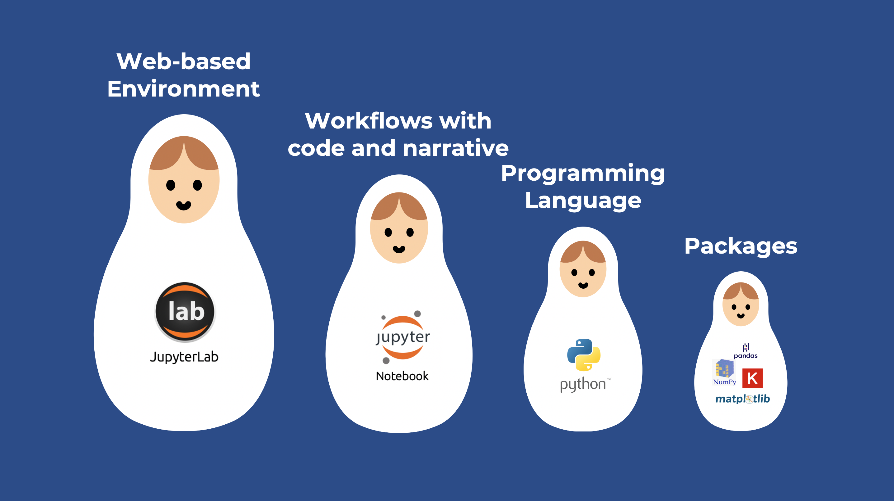

# Python and Jupyter Notebook for Medical Image Analysis

### Workshop at [OpenMR Benelux 2020](https://openmrbenelux.github.io/page-openmrb-2020/)

--- 

In this workshop, you will learn the basics of Jupyter notebook, python, and SimpleITK 

## Set up 

- See the video below: 

  
  
- Or follow the instructions below:    
  1. Download Anaconda, a python platform:  
    - Go to [anaconda.com/distribution](https://www.anaconda.com/distribution/) and click on `Download`  
    - Select your operating system and click on `Download`
    - Once downloaded, install anaconda as you would do for any software.  
  2. Download the material from GitHub:  
    - In this page, click on the green `Clone or download`button above, and then `Download Zip`. Download the files in a folder of your choice. 
    - Once downloaded, unzip the files 
   3. Install a few python packages that we will need and download the images that we will use:   
     - Open Anaconda by double-clicking on it 
     - Launch JupyterLab  
     - In the left panel, navigate to the folder you downloaded from GitHub  
     - Double click on the file `0_setup.ipynb` to open it   
     - Run the cells by going to `Run` -> `Run All Cells`  
     - Go to your workshop folder and unzip the downloaded images.

If you have any issue during the installation, go to the top of this page, click the tab `Issue`, and open an new issue. I will be happy to reply to you. 

## Content  

There are two jupyter notebooks and their correspoding solutions: 
- `1_jupyter_and_python.ipynb` and `1_jupyter_and_python_solutions.ipynb`   
- `2_SimpleITK.ipynb` and `2_SimpleITK_solutions.ipynb`  

In addition there is a list of links that can help you get familiar with the Jupyter environment, python, and SimpleITK:  
- `Resources.md`

## Video
The content of the notebook `1_jupyter_and_python.ipynb` is explained in the YouTube series 
 
[Jupyter notebook and Python for scientists](https://www.youtube.com/watch?v=aIbvUDF0Pfg&list=PLj8QFvBykB7fGEH274TlqhToqGd_Qxt1H):
 

